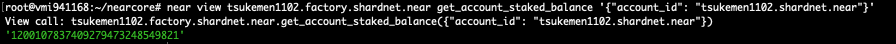

# Near Stake Wars Episode III Guideline

## I. Challenges Summary

This [file](https://github.com/near/stakewars-iii/blob/main/challenges/challenge-summary.md) contains an overview of the published and draft challenges for Stake Wars. We plan to release new challenges every few days, and this file will be constantly updated to include the new challenges tha are coming up. 

### Challenge 001
Rewards: unlocked at the end of Challenge 002.  
Submission: No submission is required for this challenge; it will be evaluated together with the next one (002).  
Purpose: Create your Shardnet wallet & deploy the NEAR CLI. This is designed to be your very first challenge: use it to understand how staking on NEAR works.  
[Refered Document](https://github.com/near/stakewars-iii/blob/main/challenges/001.md)  

1. Create a wallet.  
https://wallet.shardnet.near.org/  

2. Setup NEAR-CLI
- Setup NEAR-CLI: We will use this near CLI to run command for staking, check validator node's status and so on.  
    ```sh
    # Update apt
    sudo apt update && sudo apt upgrade -y

    # Install Node.js and npm
    curl -sL https://deb.nodesource.com/setup_18.x | sudo -E bash -  
    sudo apt install build-essential nodejs
    PATH="$PATH"
    
    # Install near-cli
    sudo npm install -g near-cli
    
    echo 'export NEAR_ENV=shardnet' >> ~/.bashrc && source .bashrc
    ```
- Near CLI Commands.  
Full list of Near CLI commands: [https://github.com/near/near-cli](https://github.com/near/near-cli)  
Some useful commands: 

    ```sh
    near proposals

    near validators current

    near validators next
    
    # More near cli commands
    near --h
    ```
### Challenge 002
Rewards: 30 Unlocked NEAR Points (UNP).  
Submission: No submission is required for this challenge; it will be evaluated together with the challenge 005.  
Purpose: This challenge is focused on deploying a node (nearcore), downloading a snapshot, syncing it to the actual state of the network, then activating the node as a validator.  
[Refered Document](https://github.com/near/stakewars-iii/blob/main/challenges/002.md)  

1. Validator Node System Requirements  
- Linux distribution: Ubuntu is referred
- 4-Core CPU with AVX support
- 8 GB RAM
- 500 GB SSD

2. Setup Validator Node
- Install dependencies:  
    ```sh
    # Check system compatibility that CPU supports AVX
    lscpu | grep -P '(?=.*avx )(?=.*sse4.2 )(?=.*cx16 )(?=.*popcnt )' > /dev/null \
    && echo "Supported" || echo "Not supported"
    Supported

    # Install Dependencies 
    sudo apt install -y git binutils-dev libcurl4-openssl-dev zlib1g-dev libdw-dev libiberty-dev cmake gcc g++ python3 docker.io protobuf-compiler libssl-dev pkg-config clang llvm cargo

    # Install Python pip
    sudo apt install python3-pip

    # Include base bin path
    USER_BASE_BIN=$(python3 -m site --user-base)/bin
    export PATH="$USER_BASE_BIN:$PATH"

    # Install build tools
    sudo apt install clang build-essential make

    # Install Rust
    curl --proto '=https' --tlsv1.2 -sSf https://sh.rustup.rs | sh
    source $HOME/.cargo/env
    ```

- Build nearcore binary:  
    ```sh
    cd ~/
    # Clone nearcore repo
    git clone https://github.com/near/nearcore
    cd ~/nearcore
    git fetch origin --tags
    # checkout runable commit
    git checkout -b c1b047b8187accbf6bd16539feb7bb60185bdc38

    # Build the binary, this will take some time
    cargo build -p neard --release --features shardnet

    # Check version of nearcore
    ./target/release/neard -V
    neard (release trunk) (build crates-0.14.0-266-g0d7f272af) (rustc 1.62.0) (protocol 100) (db 31)
    ```

- Start validator node:  
    ```sh
    cd ~/nearcore
    ./target/release/neard --home ~/.near init --chain-id shardnet --download-genesis

    # Remove old config file
    rm ~/.near/config.json
    # Download and re-configure file
    wget -O ~/.near/config.json https://s3-us-west-1.amazonaws.com/build.nearprotocol.com/nearcore-deploy/shardnet/config.json
    sed -e 's/"archive": false/"archive": true/' -i ~/.near/config.json

    # Config systemctl to manage node process
    # Create /etc/systemd/system/neard.service file with content below:
    sudo vi /etc/systemd/system/neard.service

    # START neard.service file's content
    [Unit]
    Description=neard
    After=network-online.target

    [Service]
    Type=simple
    User=root
    WorkingDirectory=/root/.near
    ExecStart=/root/nearcore/target/release/neard run   
    Restart=on-failure
    RestartSec=30
    KillSignal=SIGINT
    TimeoutStopSec=45
    KillMode=mixed

    [Install]
    WantedBy=multi-user.target
    # END neard.service file's content

    # Enable daemon and start service
    sudo systemctl enable neard.service
    # Start node
    sudo systemctl start neard
    # After start node, you need to wait for a time to sync your node.

    # run this command to monitor log
    journalctl -n 100 -f -u neard
    ```
**Wait for sync node**


3. Activate the validator node:  
- Login to near account
    ```sh
    near login
    ```
    
    
    

- Configure validator_key
    ```sh
    cp ~/.near-credentials/shardnet/<YOUR_WALLET_NAME>.shardnet.near.json ~/.near/validator_key.json
    # For Example: 
    # cp ~/.near-credentials/shardnet/tsukement1102.shardnet.near.json ~/.near/validator_key.json

    # Edit account_id and private_key of ~/.near/validator_key.json
    vi $HOME/.near/validator_key.json

    # Change from
    {
    "account_id":"tsukement1102.shardnet.near",
    "public_key":"ed25519:6FKuzv1qA9G6YxseWJD9YooQZb3a8qhDnPAhHb3sdRJD",
    "private_key":"ed25519:XXXXXXXXXXXXXXXXXXXXXXXXXXXXXXXXXXXXXXXXXXXXXXXXXXXXXXXXXXXXXXXXXXXXXXXXXXXXXXXXXXXXXXXXXXXXXXXXXXXXXXXXXXXX"
    }
    # to this
    {
    "account_id":"tsukement1102.factory.shardnet.near",
    "public_key":"ed25519:6FKuzv1qA9G6YxseWJD9YooQZb3a8qhDnPAhHb3sdRJD",
    "secret_key":"ed25519:XXXXXXXXXXXXXXXXXXXXXXXXXXXXXXXXXXXXXXXXXXXXXXXXXXXXXXXXXXXXXXXXXXXXXXXXXXXXXXXXXXXXXXXXXXXXXXXXXXXXXXXXXXXX"
    }
    # Then save the file
    
    ```  
### Challenge 003  
Rewards: 10 Unlocked NEAR Points (UNP).  
Submission: No submission is required for this challenge; it will be evaluated together with the challenge 005.  
Purpose: Deploy a new staking pool for your validator. Do operations on your staking pool to delegate and stake NEAR.  
[Refered Document](https://github.com/near/stakewars-iii/blob/main/challenges/003.md)  

1. Deploy a Staking Pool Contract:  
    ```sh
    # Replace pool_id, account_id and public_key following yours
    near call factory.shardnet.near create_staking_pool '{"staking_pool_id": "<pool_id>", "owner_id": "<account_id>", "stake_public_key": "<public_key>", "reward_fee_fraction": {"numerator": 5, "denominator": 100}, "code_hash":"DD428g9eqLL8fWUxv8QSpVFzyHi1Qd16P8ephYCTmMSZ"}' --accountId="<account_id>" --amount=30 --gas=300000000000000
    # For example:
    near call factory.shardnet.near create_staking_pool '{"staking_pool_id": "tsukemen1102", "owner_id": "tsukemen1102.shardnet.near", "stake_public_key": "6FKuzv1qA9G6YxseWJD9YooQZb3a8qhDnPAhHb3sdRJD", "reward_fee_fraction": {"numerator": 5, "denominator": 100}, "code_hash":"DD428g9eqLL8fWUxv8QSpVFzyHi1Qd16P8ephYCTmMSZ"}' --accountId="tsukemen1102.shardnet.near" --amount=600 --gas=300000000000000
    ```

2. Check your node on explorer:  
    Go to https://explorer.shardnet.near.org/nodes/validators and find your node: 
    

- View staked balance:  
    ```sh
    near view tsukemen1102.factory.shardnet.near get_account_staked_balance '{"account_id": "tsukemen1102.shardnet.near"}'
    ```  
    

### Challenge 004  
Rewards: 15 Unlocked NEAR Points (UNP).  
Submission: No submission is required for this challenge; it will be evaluated together with the challenge 005.  
Purpose: Setup tools for monitoring node status. Install and use RPC on port 3030 to get useful information for keep your node working.  
[Refered Document](https://github.com/near/stakewars-iii/blob/main/challenges/004.md)  

- Setup NEAR-CLI: We will use this near CLI to run command for staking, check validator node's status and so on.  
    ```sh
    # install jq
    apt install jq -y
    
    # Check your node version
    curl -s http://127.0.0.1:3030/status | jq .version

    # Check delegators and stake 
    near view tsukemen1102.factory.shardnet.near get_accounts '{"from_index": 0, "limit": 10}' --accountId tsukemen1102.shardnet.near

    # Check reason for validator kicked
    curl -s -d '{"jsonrpc": "2.0", "method": "validators", "id": "dontcare", "params": [null]}' -H 'Content-Type: application/json' https://rpc.shardnet.near.org/ | jq -c '.result.prev_epoch_kickout[] | select(.account_id | contains ("tsukemen1102"))' | jq .reason

    # Check blocks produced / expected 
    curl -s -d '{"jsonrpc": "2.0", "method": "validators", "id": "dontcare", "params": [null]}' -H 'Content-Type: application/json' http://localhost:3030/ | jq -c '.result.current_validators[] | select(.account_id | contains ("tsukemen1102.factory.shardnet.near"))'
    ```
    


### Challenge 005  
Rewards: 10 Unlocked NEAR Points (UNP).  
Submission: [Submit the form with your work.](https://docs.google.com/forms/d/e/1FAIpQLScp9JEtpk1Fe2P9XMaS9Gl6kl9gcGVEp3A5vPdEgxkHx3ABjg/viewform).  
Purpose: Setup a running validator node for shardnet on any one of the most popular cloud providers and document the process to create an article about it.  
[Refered Document](https://github.com/near/stakewars-iii/blob/main/challenges/005.md)  

1. Signup AWS Account:  
Go to [aws signup page](https://portal.aws.amazon.com/billing/signup#/start/email), input required information then do signup new account.  

2. Launch EC2 instance:  
After your account had been activated, go to AWS EC2 service to launch an EC2 instance.  
Follow [this tutorial](https://docs.aws.amazon.com/efs/latest/ug/gs-step-one-create-ec2-resources.html) to launch new EC2 instance with below specifications.  
- EC2 Instance System Requirements  
  - Linux distribution: Ubuntu v20.x is referred (Free)
  - 4-Core CPU with AVX support (Minimum EC2 c5.xlarge, reference: EC2 c5.2xlarge)
  - 8 GB RAM
  - 500 GB SSD (General Purpose SSD - Storage $0.08/GB-month)
  - Minimum Monthly Cost: **165$** (~125$ EC2 c5.xlarge type + 40$ 500GB SSD)

After start, access to instance bay SSH tool as screenshot. Then do following challenge 002->009.


### Challenge 006  
Rewards: 5 Unlocked NEAR Points (UNP).  
Submission: [Submit the form with your work.](https://docs.google.com/forms/d/e/1FAIpQLScp9JEtpk1Fe2P9XMaS9Gl6kl9gcGVEp3A5vPdEgxkHx3ABjg/viewform).  
Purpose: Create a cron task on the machine running node validator that allows ping to network automatically.  
[Refered Document](https://github.com/near/stakewars-iii/blob/main/challenges/006.md)  

- Create a cron job to run ping every epoch:
    ```sh
    crontab -e 
    
    # A ping issues a new proposal and updates the staking balances for your delegators. A ping should be issued each epoch to keep reported rewards current.
    NEAR_ENV=shardnet  
    # running every 15 minutes:
    */15 * * * * near call tsukemen1102.factory.shardnet.near ping '{}' --accountId tsukemen1102.shardnet.near --gas=300000000000000 >> $HOME/cron.log
    ```  
    
    **CronTab**
      
    
    **Pings**
      

## II. Useful Tips
1. SSH: you need to use ssh potocol to access your server by [Putty](https://www.hostinger.com/tutorials/how-to-use-putty-ssh).
2. Update after hardfork
- Checkout new source code and rebuild nearcore binary:  
    ```sh
    cd ~/nearcore
    git fetch origin --tags
    # checkout runable commit
    git checkout -b c1b047b8187accbf6bd16539feb7bb60185bdc38

    # Build the binary, this will take some time
    cargo build -p neard --release --features shardnet

    # Check version of nearcore
    ./target/release/neard -V
    neard (release trunk) (build crates-0.14.0-266-g0d7f272af) (rustc 1.62.0) (protocol 100) (db 31)
    
    # Restart node
    systemctl restart neard
    
    # run this command to monitor log
    journalctl -n 100 -f -u neard
    ```
    

